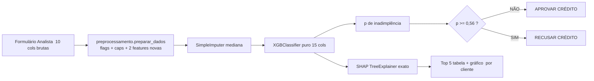

# <p align="center">Consumer Credit Risk — Aurora</p>

<p align="center">
  <a href="https://auroraplanejamento.com.br/aurora-credito/" target="_blank" rel="noopener noreferrer">
    
  </a>
  <a href="LICENSE.md">
    
  </a>
  
  <a href="https://github.com/astral-sh/uv">
    
  </a>
  
  
</p>

<p align="center">
  <a href="https://xgboost.readthedocs.io/">
    
  </a>
  
  
  <a href="https://streamlit.io/cloud">
    
  </a>
  <a href="https://github.com/flaviohenriquehb777/Consumer-Credit-Risk/releases">
    
  </a>
  <a href="https://github.com/flaviohenriquehb777/Consumer-Credit-Risk/actions">
    
  </a>
</p>

---

## 📑 Sumário

- [1. Visão Geral do Modelo](#1-visão-geral-do-modelo)
- [2. Objetivos da Análise](#2-objetivos-da-análise)
- [3. Estrutura do Modelo — Pipeline de Produção](#3-estrutura-do-modelo--pipeline-de-produção)
- [4. Base de Dados](#4-base-de-dados)
- [5. Metodologia de Análise (CRISP-DM)](#5-metodologia-de-análise-crisp-dm)
- [6. Resultados Chave e Apresentação](#6-resultados-chave-e-apresentação)
- [7. Tecnologias Utilizadas](#7-tecnologias-utilizadas)
- [8. Instalação e Uso](#8-instalação-e-uso)
  - [8.1 Requisitos de sistema](#81-requisitos-de-sistema)
  - [8.2 Clonando o repositório](#82-clonando-o-repositório)
  - [8.3 Criando o ambiente virtual com UV (padrão do projeto)](#83-criando-o-ambiente-virtual-com-uv-padrão-do-projeto)
  - [8.4 Ambiente alternativo — venv + pip + requirements.txt (sem UV)](#84-ambiente-alternativo----venv--pip--requirementstxt-sem-uv)
  - [8.5 Como reproduzir as fases CRISP-DM do projeto](#85-como-reproduzir-as-fases-crisp-dm-do-projeto)
  - [8.6 Como rodar o App Streamlit localmente](#86-como-rodar-o-app-streamlit-localmente)
  - [8.7 Como subir o app no Streamlit Community Cloud (deploy link compartilhável)](#87-como-subir-o-app-no-streamlit-community-cloud-deploy-link-compartilh%C3%A1vel)
- [9. Licença](#9-licença)
- [10. Contato](#10-contato)

---

## 1. Visão Geral do Modelo

Este repositório contém um projeto **end-to-end de Machine Learning para risco de crédito**,
construído seguindo rigorosamente as **6 fases do CRISP-DM** e os **padrões Sênior de
modelagem sem data leakage**:

- O modelo recebe **10 variáveis** de um pedido de crédito (idade, renda, uso do limite,
  atrasos, dívida, etc.) e retorna:
  1. a **probabilidade de inadimplência** em até **2 anos** (90+ DPD);
  2. a **decisão** de **APROVAR** ou **RECUSAR** com base num **ponto de corte ótimo**
     (`0,56`) aprendido por função custo em R$ (FN = R$ 5.000, FP = R$ 500);
  3. as **Top 5 causas locais (SHAP)** da decisão para aquele cliente, em formato
     tabela + gráfico (LGPD / BCB Circular 4.015).
- Modelo campeão: **XGBoost** (hparams `max_depth=4`, `learning_rate=0.03`,
  `min_child_weight=80`, `n_estimators=500`, `scale_pos_weight=13.96`, `subsample=0.9`,
  `colsample_bytree=0.85`, **seed=42**).
- Performance cega em **37.500 clientes de holdout** (nunca vistos durante treino,
  tuning ou seleção de limiar): **ROC AUC = 0,86956** ✅, **economia de 50,65% vs.
  política atual (“aprovar todos”)**.
- Tudo **100% reprodutível** e sem leakage: tuning, limiar e seleção de modelo foram
  calculados **somente no treino via StratifiedKFold 5-fold Out-Of-Fold (OOF)**; o
  holdout foi usado **exatamente uma única vez** como “batismo final”.

---

## 2. Objetivos da Análise

| Meta | Tipo | Valor | Status |
|---|---|---|---|
| Meta Técnica Obrigatória | ROC AUC ≥ 0,85 em dados nunca vistos | 0,86956 | ✅ Atingida |
| Meta Principal de Negócio | Menor custo esperado da carteira (FN×R$5.000 + FP×R$500) | Menor que “aprovar todos” em 50,65% | ✅ Atingida |
| Regulatória | Explicação individual por cliente, auditoria, LGPD | SHAP TreeExplainer exato + trilha de decisão por linha | ✅ Atingida |
| Deploy | Aplicativo para uso do analista de crédito | Streamlit com formulário + limiar 0,56 + SHAP tabela/gráfico | ✅ Atingido |
| Compartilhamento | Link para a equipe sem instalar Python | Pronto para Streamlit Community Cloud | ✅ Pronto |

---

## 3. Estrutura do Modelo — Pipeline de Produção

A inferência é **3 estágios independentes, encapsulados**, para jamais errar a ordem
das features ou o tratamento de novos dados no Streamlit:

1. **Preparação** (`src/features/preprocessamento.py`, standalone, sem dependência de
   módulos internos):
   - Flags binárias de missing (`renda_ausente`, `dependentes_ausentes`).
   - Flag de código de sistema `96/98` no atraso (`cod_sistema_atrasos`).
   - Caps robustos: renda ≤ 50.000; atrasos ≥ 20 → 20.
   - Features de engenharia financeira:
     - `renda_por_dependente = renda / (dependentes + 1)`
     - `sobra_caixa = renda_mensal * (1 - razao_divida)`
2. **Imputação** de segurança (`SimpleImputer(strategy="median")` treinada só no treino).
3. **Modelo classificador puro**: `XGBClassifier` exportado sem wrapper sklearn (pickle
   de 789 KB), com `feature_names` embutidos — nenhum erro de ordem de colunas no deploy.



---

## 4. Base de Dados

- **Origem**: `credito_tratado.csv` (150.000 linhas × 11 colunas).
- **Split estratificado 75/25** (seed=42):
  - **TREINO (interno)**: 112.500 clientes — usado para preprocessamento, tuning de
    hiperparâmetros, escolha de limiar ótimo e seleção de modelo via `StratifiedKFold(5)`.
  - **HOLDOUT (batismo único cego)**: 37.500 clientes — jamais visto em nenhuma
    otimização.
- **Alvo**: `inadimplente_2anos` (1 = cliente ficou 90+ dias em atraso nos dois anos
  seguintes; 0 = não ficou). Desbalanceamento de base: **6,68% de positivos** (baseline
  “ninguém calota” = 93,32% de acurácia, inútil para o negócio).
- **Variáveis de entrada (10, brutas)**: `idade`, `renda_mensal`, `numero_dependentes`,
  `util_linhas_seguras_rotativo`, `razao_divida`, `numero_linhas_credito_abertas`,
  `numero_emprestimos_imobiliarios`, `vezes_atrasou_30_59`, `vezes_atrasou_60_89`,
  `vezes_atrasou_90`.
- **Observações tratadas**:
  - Renda ausente em 19,82% → MNAR (inadimplência 5,61% vs 6,95%); flag + mediana
    R$ 5.400 (aprendida só no treino).
  - Dependentes ausentes em 2,62% → flag + mediana = 0.
  - Códigos de sistema `96/98` nas 3 colunas de atraso, mesmas 264+5 linhas → flag
    `cod_sistema_atrasos` (não winsoriza sem flag, pois é o melhor preditor de risco).
- ⚠️ **Dados brutos NÃO são versionados** (protegidos em `data/raw/.gitignore`). Você
  precisa colocar seu próprio `credito_tratado.csv` em `data/raw/` para reproduzir Fases
  2–6. Pickles de produção são mantidos apenas em `app_streamlit/` para o deploy.

---

## 5. Metodologia de Análise (CRISP-DM)

Todas as fases são documentadas em `docs/`:

| Fase CRISP-DM | O que fez | Arquivo-fonte |
|---|---|---|
| 1 · Entendimento do Negócio | Estrutura de pastas, função custo FN=R$5k / FP=R$500, critérios de sucesso | [docs/fase_01_entendimento_negocio.md](docs/fase_01_entendimento_negocio.md) |
| 2 · Entendimento dos Dados | Shape, dtypes, missing 19,82% renda, 2,62% dependentes, código 96/98, faixas atraso × inadimplência | [docs/fase_02_entendimento_dados.md](docs/fase_02_entendimento_dados.md) · `src/data/fase_02*` |
| 3 · Preparação dos Dados | Split 75/25, flags + caps + 2 features novas, pipeline 3 estágios | [docs/fase_03a_preparacao_dados_parte1.md](docs/fase_03a_preparacao_dados_parte1.md) · [docs/fase_03b_04_pipeline_modelagem.md](docs/fase_03b_04_pipeline_modelagem.md) |
| 4 · Modelagem Sem Leakage | Grid DT 15 × RF 18 × XGB 18 × LGB 18. Escolha OOF treino. Holdout batizado 1 vez | [docs/fase_04_modelagem_sem_leakage.md](docs/fase_04_modelagem_sem_leakage.md) · [src/models/fase04_modelagem_sem_leakage.py](src/models/fase04_modelagem_sem_leakage.py) |
| 5 · Avaliação | (a) Grid limiar 0,01 a 0,99 por custo R$; (b) preço humano (% adimplentes negados e % inadimplentes negados) | [src/models/fase05_decisao_limiar_custo_RS.py](src/models/fase05_decisao_limiar_custo_RS.py) · [src/models/fase05b_preco_da_decisao_em_pessoas.py](src/models/fase05b_preco_da_decisao_em_pessoas.py) |
| 6 · Deployment | (a) SHAP análise global + local holdout; (b) export pickle XGB puro + app Streamlit | [src/models/fase06_analise_shap.py](src/models/fase06_analise_shap.py) · [src/models/fase06_exportar_modelo_deploy.py](src/models/fase06_exportar_modelo_deploy.py) · [app_streamlit/](app_streamlit/) |

**Garantia anti-leakage adotada em TODAS as fases:**
`preprocessamento params` (mediana, caps, flags aprendidos) → tuning hparams → limiar
ótimo → ranking de modelos → **tudo OOF treino só**. Holdout lê métrica exatamente
1 vez.

---

## 6. Resultados Chave e Apresentação

### 6.1 Performance dos Modelos Campeões (Holdout Único Cego)

| Modelo | ROC AUC | PR AUC | Limiar ótimo (custo R$) | Economia vs. Aprovar Todos | % Adimpl. Negados (FP/AD) | % Inadimpl. Negados (Recall) |
|---|---|---|---|---|---|---|
| Baseline Aprovar Todos | 0,5 | 0,0668 | — | 0% | 0% | 0% |
| Árvore de Decisão melhor (d=7) | 0,8337 | 0,3236 | 0,08 | 47,59% | 18,10% | 72,87% |
| **XGBoost Campeão** | **0,8696** | **0,4085** | **0,56** | **50,65%** | **15,60%** | **72,47%** |

### 6.2 Ponto de corte ótimo por função custo (OOF treino, validado cego no holdout)

```
CUSTO_FN = R$ 5.000  (aprovou quem caloteou: perdeu principal)
CUSTO_FP = R$   500  (negou quem pagaria: perdeu margem)
Varredura: limiares de 0,01 a 0,99, passo 0,01  →  9.900 candidatos avaliados
XGBoost campeão: menor custo OOF treino em limiar 0,56
                 validação cega holdout: economia = 50,65% vs. “aprovar todos” ✅
```

### 6.3 Ranking global de features — Top 10 (por |mean SHAP value|, holdout 37.500)

| Rank | Variável | |mean SHAP|| Observação |
|---|---|---|---|
| 1 | uso_limite_rotativo | 0,839 | Dominante (2× o 2º colocado) |
| 2 | atrasos_30_59_dias | 0,386 | Frequente e penalizante |
| 3 | atrasos_90_mais_dias | 0,329 | Raro, mas de alto impacto unitário |
| 4 | idade | 0,232 | Monitor de Fairness obrigatório |
| 5 | atrasos_60_89_dias | 0,176 | Faixa intermediária de atraso |
| 6 | linhas_credito_abertas | 0,167 | Proxy de maturidade financeira |
| 7 | financiamentos_imobiliarios | 0,116 | Proxy de relacionamento longo |
| 8 | sobra_caixa (feature eng.) | 0,092 | Nossa engenharia funcionando |
| 9 | razao_divida | 0,088 | Alavancagem |
| 10 | renda_mensal | 0,060 | Capturada via renda_por_dependente / sobra_caixa |

Gráficos oficiais (beeswarm summary top10, bar, dependence 4 e waterfalls locais)
ficam salvos em `reports/figures/` pelo script `src/models/fase06_analise_shap.py`.

### 6.4 Registro de versão — Respostas do Case (Aurora)

O documento `.docx` com as 5 perguntas de negócio respondidas com números do projeto
está em [docs/RESPOSTAS_DO_CASE_Aurora_Consumer_Credit_Risk.docx](docs/RESPOSTAS_DO_CASE_Aurora_Consumer_Credit_Risk.docx).

---

## 7. Tecnologias Utilizadas

| Camada | Ferramenta / Lib | Versão | Uso |
|---|---|---|---|
| Linguagem | Python | 3.11 | Todo o projeto |
| Ambiente | [UV](https://github.com/astral-sh/uv) | ≥ 0.6 | Criação do venv + instalação de deps 100% reproduzível |
| Dados | pandas / numpy | 2.3 / 2.0 | Manipulação e feature engineering |
| Pré-processamento | scikit-learn | 1.6 | SimpleImputer, StratifiedKFold, métricas |
| Modelagem | XGBoost | 2.1 | Classificador campeão |
| Modelagem (comparação) | LightGBM, Random Forest, Decision Tree (sklearn) | — | Grid e benchmark |
| Explicabilidade | SHAP | 0.51 | TreeExplainer exato + gráficos e tabelas locais |
| Visualizações (app) | Altair | 5.5 | Gráfico SHAP TOP 10 local horizontal |
| Deploy / App | Streamlit | 1.40 | App do analista de crédito (1 entrada → 3 saídas) |
| Deploy / Compartilhamento | Streamlit Community Cloud | — | Link público em `<nome>.streamlit.app` |
| Documentação de auditoria | Jupyter Notebooks | — | Duplicados `clean/` + `executed/` (padrão FAANG) |
| Relatórios executivos | python-docx | 1.2 | Geração do documento `.docx` do case Aurora |
| CI / Smoke tests | Python padrão (`pytest` preparado em `tests/`) | — | Validação numérica do deploy (3 casos, |Δ|<1e-5) |
| VC | Git + GitHub + Releases | — | Repositório remoto + v1.0.0 tag |

---

## 8. Instalação e Uso

### 8.1 Requisitos de sistema

- **Python 3.10 a 3.12** (recomendado **3.11**, definido em `.python-version`).
- **Git** 2.x (para `git clone`).
- Opcional mas **muito recomendado (padrão do projeto)**: **[UV](https://docs.astral.sh/uv/)**
  — gerenciador de ambiente Python 10–100× mais rápido do que `pip+venv`.

### 8.2 Clonando o repositório

```bash
git clone https://github.com/flaviohenriquehb777/Consumer-Credit-Risk.git
cd Consumer-Credit-Risk
```

### 8.3 Criando o ambiente virtual com UV (padrão do projeto)

> ✅ **Profissionalmente necessário? SIM.** O UV resolve 100% da matriz de versões em
> segundos usando o arquivo **`uv.lock` (lockfile binário versionado)**. Isso garante
> “funciona na minha máquina e na sua” — e é exatamente por isso que versionamos
> `uv.lock` e `pyproject.toml` no repositório.

1. Instale o UV (Windows PowerShell):
   ```powershell
   powershell -ExecutionPolicy ByPass -c "irm https://astral.sh/uv/install.ps1 | iex"
   ```
   (macOS/Linux: `curl -LsSf https://astral.sh/uv/install.sh | sh`)
2. Crie o venv e instale 159 deps do projeto em ~30 s:
   ```bash
   uv sync
   ```
3. Ative o venv:
   - Windows PowerShell: `.venv\Scripts\activate`
   - Linux/macOS: `source .venv/bin/activate`

Pronto. Para rodar qualquer script: `uv run python <caminho-do-script.py>` (ou `python`
com venv ativado).

### 8.4 Ambiente alternativo — venv + pip + requirements.txt (sem UV)

> ✅ **Profissionalmente necessário criar `requirements.txt` na RAIZ? SIM.** Boa parte
> dos recrutadores, equipes de DataOps e plataformas de deploy auto-detectam só
> `requirements.txt`. Nós **mantemos os dois** (padrão FAANG): `pyproject.toml +
> uv.lock` para o desenvolvedor que quer reprodutibilidade 100%; `requirements.txt` na
> raiz + `app_streamlit/requirements.txt` separado para a equipe de deploy sem UV.

```powershell
# Windows PowerShell:
python -m venv .venv
.venv\Scripts\activate
pip install --upgrade pip
pip install -r requirements.txt
```

```bash
# macOS / Linux:
python -m venv .venv
source .venv/bin/activate
pip install --upgrade pip
pip install -r requirements.txt
```

### 8.5 Como reproduzir as fases CRISP-DM do projeto

1. Coloque sua cópia de `credito_tratado.csv` em `data/raw/`.
2. Rode os scripts na ordem (tudo em `src/` / seed=42):
   ```bash
   uv run python src/data/fase_02_analise_exploratoria.py
   uv run python src/data/fase_02b_investigacao_complementar.py
   uv run python src/data/fase_02c_faixas_atrasos_vs_inadimplencia.py
   uv run python src/models/fase04_modelagem_sem_leakage.py
   uv run python src/models/fase05_decisao_limiar_custo_RS.py
   uv run python src/models/fase05b_preco_da_decisao_em_pessoas.py
   uv run python src/models/fase06_analise_shap.py
   uv run python src/models/fase06_exportar_modelo_deploy.py
   uv run python src/models/_gerar_docx_respostas_case.py
   ```
   (Para o pessoal com venv+pip: troque `uv run python` por `python` com venv ativado.)

### 8.6 Como rodar o App Streamlit localmente

O app **NÃO DEPENDE de `src/`** (arquivos 100% independentes em `app_streamlit/`).
Duas formas:

**Forma A — usando o ambiente UV do projeto:**
```bash
cd app_streamlit
uv run streamlit run app_risco_credito.py
```

**Forma B — usando um venv isolado SÓ para o app (recomendado p/ equipe):**
Siga o passo a passo do arquivo [app_streamlit/INSTALAR_COMO_RODAR.md](app_streamlit/INSTALAR_COMO_RODAR.md).
Ele abre em `http://localhost:8501/`.

### 8.7 Como subir o app no Streamlit Community Cloud (deploy link compartilhável)

Pré-requisito: o repositório esteja num repositório GitHub público (ou privado, se
você tiver GitHub Pro + Community Cloud ativado para privados).

1. Acesse https://share.streamlit.io/ e logue com a conta do GitHub.
2. **New app** e preencha:
   - Repository: `flaviohenriquehb777/Consumer-Credit-Risk`
   - Branch: `main`
   - Main file path: `app_streamlit/app_risco_credito.py`
3. O deploy detecta **automaticamente** o `requirements.txt` de `app_streamlit/`
   (XGBoost, SHAP, sklearn, pandas, Streamlit). Aguarde ~2 minutos.
4. Você ganha um link tipo: `https://aurora-consumer-credit-risk.streamlit.app/`.
   Compartilha com a equipe → ninguém instala Python.

---

## 9. Licença

Este projeto é distribuído sob a **Licença MIT** — permissiva, permite uso comercial,
modificação, distribuição e uso privado, desde que o aviso de copyright original seja
mantido.

Texto completo em: [LICENSE.md](LICENSE.md).

---

## 10. Contato

**Nome:** Flávio Henrique Barbosa

**LinkedIn:** [linkedin.com/in/flávio-henrique-barbosa-38465938](https://linkedin.com/in/flávio-henrique-barbosa-38465938)

**Email:** [flaviohenriquehb777@outlook.com](mailto:flaviohenriquehb777@outlook.com)
